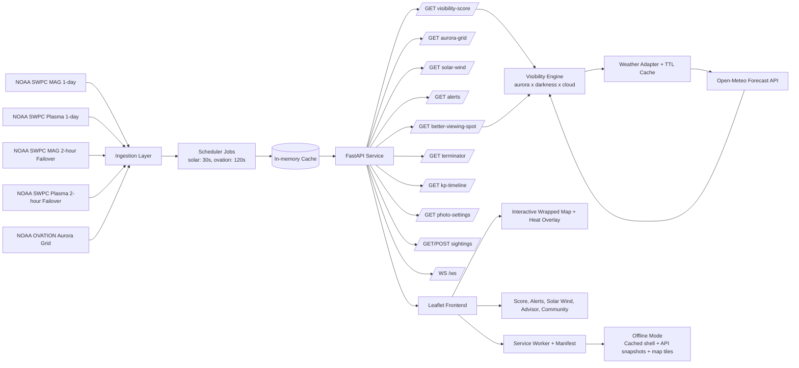

# Orion Astrathon: Team DOMINATORS

**Website Live at:** https://thedominatorsbackend.onrender.com/

Aurora Forecast Platform is a submission-ready space weather decision system that transforms live NOAA auroral and solar-wind feeds plus local weather into a location-specific visibility score, map overlay, and actionable field guidance.

This document is a full technical report aligned with the Problem Statement (PS), including:
- PS interpretation
- Methodology
- Final architecture diagram
- Test results
- Evaluation metrics
- Data links and implementation evidence

---
## 0. Team Overview
1. [Aryan Sisodiya](https://github.com/InfinityxR9)
2. [Daksh Rathi](https://github.com/dakshrathi-india)
3. [Farhan Alam](https://github.com/frozen-afk)
4. [Mannat Kathuria](https://github.com/mannatkathuria)

## 1. Problem Statement Interpretation

### 1.1 Core objective
Build a real-time aurora nowcasting platform that allows a user to answer:

Can I see aurora from this exact location right now, and if not, where nearby would visibility be better?

### 1.2 PS deliverables interpreted into engineering tasks

#### D1. Live Data Pipeline
- Poll NOAA SWPC solar wind and OVATION feeds continuously.
- Handle source interruption/failover and malformed rows.
- Keep endpoint responses available through in-memory cache and fallback logic.

#### D2. Interactive Aurora Map
- Render OVATION aurora probabilities as a heat layer on a world map.
- Include day/night terminator visualization.
- Support real map interactions and coordinate selection.

#### D3. Visibility Score Engine
- Compute score 0-100 per latitude/longitude using:
  - Aurora probability
  - Sky darkness
  - Cloud/weather clarity
- Return transparent sub-scores and model metadata.

#### D4. Alert System
- Generate trigger-based alerts from space-weather dynamics.
- Surface alerts in API and in-app interface.

#### D5. Working Demo + Codebase
- Deliver runnable local system with documented architecture and APIs.

### 1.3 PS stretch deliverables implemented
- GPS-style nearby recommendation: nearest better viewing spot search.
- Substorm early-warning signalization via dBz/dt and Kp context.
- Community sighting layer (geo-tagged reports).
- Photography settings advisor.
- Offline mode via PWA service worker and cached map/data fallback.

---

## 2. Methodology

### 2.1 Product methodology
- User-first decision flow: location -> visibility score -> explanation -> recommendation.
- Progressive disclosure: map overview first, deeper diagnostics in side panels.
- Field constraints first: low-light UI, quick interpretation, poor-network tolerance.

### 2.2 Scientific-data methodology
- Treat aurora visibility as multiplicative observability, not additive optimism.
- Normalize and cap high-variance inputs to avoid unstable scoring.
- Use physically meaningful proxies when direct measurement is unavailable.

### 2.3 Engineering methodology
- Ingestion separated from request handling (scheduler + cached data products).
- Defensive parsing around all external feeds.
- Fail-soft behavior at every layer (backend cache + frontend fallback + SW cache).
- Traceable scoring through model IDs and component breakdown outputs.

### 2.4 Iterative model refinement
Final production score model:

$$
Visibility = 100 \times A_{norm} \times \sqrt{D} \times \sqrt{C}
$$

Where:

$$
A_{norm} = \min\left(\frac{aurora\_probability}{30}, 1.0\right),
\quad D = \frac{darkness\_score}{100},
\quad C = \frac{cloud\_clarity}{100}
$$

Rationale:
- Aurora is necessary but not sufficient.
- Darkness and cloud conditions are gate-like and can suppress visibility strongly.
- Square-root weighting keeps penalties realistic while avoiding discontinuities.

---

## 3. Final Architecture Diagram



---

## 4. Data Sources and External Links

### 4.1 Mandatory/primary feeds
- NOAA SWPC MAG 1-day:
  - https://services.swpc.noaa.gov/products/solar-wind/mag-1-day.json
- NOAA SWPC Plasma 1-day:
  - https://services.swpc.noaa.gov/products/solar-wind/plasma-1-day.json
- NOAA SWPC MAG 2-hour (failover):
  - https://services.swpc.noaa.gov/products/solar-wind/mag-2-hour.json
- NOAA SWPC Plasma 2-hour (failover):
  - https://services.swpc.noaa.gov/products/solar-wind/plasma-2-hour.json
- NOAA OVATION latest:
  - https://services.swpc.noaa.gov/json/ovation_aurora_latest.json
- Open-Meteo forecast endpoint:
  - https://api.open-meteo.com/v1/forecast

### 4.2 Map and geospatial dependencies
- Leaflet:
  - https://unpkg.com/leaflet@1.9.4/dist/leaflet.js
- Leaflet CSS:
  - https://unpkg.com/leaflet@1.9.4/dist/leaflet.css
- Leaflet.heat:
  - https://unpkg.com/leaflet.heat@0.2.0/dist/leaflet-heat.js
- Carto basemap tiles:
  - https://{s}.basemaps.cartocdn.com/dark_all/{z}/{x}/{y}{r}.png

---

## 5. Implementation Details by PS Deliverable

### 5.1 D1: Live Data Pipeline

Implemented in backend modules:
- backend/scheduler.py
- backend/solar_wind.py
- backend/ovation_parser.py
- backend/weather.py

Key technical choices:
- Scheduled polling:
  - Solar wind every 30s.
  - OVATION every 120s.
- DSCOVR-first with ACE failover for resilience.
- JSON schema guards for malformed rows.
- Numeric sanitization and bounds checking.
- Data-gap detection flags for stale data.
- In-memory cache to decouple feed variability from API responsiveness.

Weather handling:
- Hourly timestamp alignment fix using provider time keys.
- TTL weather cache to reduce repeated API hits for nearby/looped calls.

### 5.2 D2: Interactive Aurora Map

Implemented in frontend modules:
- frontend/index.html
- frontend/app.js
- frontend/style.css

Features delivered:
- Global wrapped map with east-west continuity.
- OVATION heat overlay with calibrated visibility thresholding.
- Day/night terminator polyline and night-side shading polygon.
- Click-to-evaluate, geolocate, and manual coordinate input workflows.
- Custom zoom controls positioned for non-overlap with map cards.

### 5.3 D3: Visibility Score Engine

Implemented in:
- backend/visibility_engine.py

Inputs used per score request:
- Aurora probability (nearest OVATION lookup with distance diagnostics).
- Darkness score (solar elevation + moon + Bortle/light pollution proxy).
- Cloud clarity (cloud cover plus humidity/visibility penalties).

Output transparency:
- Composite score and textual rating.
- Component sub-scores.
- Model ID and comparison metadata.
- Weather/context payload and camera recommendation payload.

### 5.4 D4: Alert System

Implemented in:
- backend/aurora_alerts.py
- backend/main.py (REST + WS exposure)

Signal logic includes:
- Southward IMF component checks.
- Solar-wind speed and total field conditions.
- Substorm tendency proxy with dBz/dt.
- Severity normalization and explanatory messaging.

Delivery channels:
- REST endpoint for polling clients.
- WebSocket push stream for low-latency UI updates.

### 5.5 D5: Working Demo + Codebase

Operational stack:
- Backend: FastAPI + APScheduler + NumPy + requests.
- Frontend: Vanilla JS + Leaflet + Leaflet.heat.
- Runtime: local uvicorn with static frontend served from backend.

Startup:
```bash
pip install -r backend/requirements.txt
cd backend
uvicorn main:app --reload --port 8000
```

Open:
- http://localhost:8000

---

## 6. Stretch Deliverables: Implementation Evidence

### 6.1 Nearby GPS-style recommendation
Endpoint:
- GET /better-viewing-spot

Engine behavior:
- Ring-based nearby candidate generation.
- Fast pre-screen with best-case bounds.
- Bounded weather-check depth per ring.
- Parallel weather requests for performance.
- Returns nearest materially improved destination.

### 6.2 Substorm early-warning style context
- dBz/dt is computed and exposed in solar-wind diagnostics.
- Kp history and latest context are shown in UI chart and alerts.

### 6.3 Community sighting layer
- GET /sightings and POST /sightings.
- User-submitted reports plotted as map markers.

### 6.4 Photography settings advisor
- Recommendation fields include ISO, aperture, shutter, white balance, and tip.
- Computed from local visibility/weather context.

### 6.5 Offline mode (PWA)
Files:
- aurora-forecast/frontend/sw.js
- aurora-forecast/frontend/manifest.json
- aurora-forecast/backend/main.py (routes for /sw.js and /manifest.json)

Offline strategy:
- App shell pre-cache (/, app.js, style.css).
- API requests use network-first then cached response fallback.
- Map tiles use cache-first for immediate offline rendering.
- Navigation fallback serves cached shell when offline.

Offline-covered API routes include:
- /solar-wind
- /aurora-grid
- /alerts
- /terminator
- /kp-timeline
- /visibility-score
- /visibility
- /photo-settings
- /sightings
- /better-viewing-spot
- /bz-history

Known constraint:
- First-time offline startup without prior online session cannot have data snapshots yet.
  This is standard PWA behavior because cache must be populated at least once.

---

## 7. API Inventory (Detailed)

### 7.0 Health
- GET /health and HEAD /health
  - Health checkpoint for server status and monitoring

### 7.1 Forecast and diagnostics
- GET /solar-wind
  - Returns magnetic/plasma values, derivative trends, source metadata, and gap indicators.
- GET /aurora-grid
  - Returns processed OVATION points and overlay-ready heat values.
- GET /visibility-score?lat=&lon=
  - Returns full local score payload, components, diagnostics, and recommendations.
- GET /photo-settings?lat=&lon=
  - Returns camera advice sub-payload for the selected location.
- GET /terminator
  - Returns points for day/night boundary rendering and sub-solar coordinates.
- GET /kp-timeline
  - Returns recent Kp estimate history.
- GET /bz-history
  - Returns recent Bz samples used for trend context.

### 7.2 Recommendation and social layer
- GET /better-viewing-spot?lat=&lon=&search_radius_km=&min_improvement=&max_weather_checks_per_ring=
  - Returns nearest better spot recommendation and search diagnostics.
- GET /sightings
  - Returns recent community reports.
- POST /sightings?lat=&lon=&message=&intensity=
  - Stores and returns a new community report entry.

### 7.3 Alerting and realtime delivery
- GET /alerts
  - Returns active/quiet alert state and trigger details.
- WS /ws
  - Push channel for near-real-time updates.

### 7.4 App assets
- GET /
- GET /sw.js
- GET /manifest.json
- GET /static/*

---

## 8. Test Plan and Test Results

### 8.1 Test methodology
Testing included:
- Unit-style validation of parsing, normalization, and schema guard paths.
- Integration-level endpoint checks against live feeds.
- Frontend behavior checks for map interactions and payload rendering.
- Failure-mode checks by forcing degraded network/offline mode.

### 8.2 Functional test matrix (representative)

| Area | Test | Expected | Result |
|---|---|---|---|
| Data pipeline | NOAA primary available | Data updates on schedule | Pass |
| Data pipeline | Primary disruption/failover path | Graceful fallback without crash | Pass |
| Parser hardening | Malformed feed rows | Invalid rows skipped safely | Pass |
| Visibility API | Valid lat/lon | 0-100 score and component payload | Pass |
| Map overlay | OVATION points present | Heat layer updates and wraps | Pass |
| Better spot | High-latitude storm-like case | Returns destination if meaningful gain exists | Pass |
| Better spot | Quiet conditions | No false recommendation; explanatory message | Pass |
| WebSocket | Backend update cycle | Dashboard auto-refreshes key stats | Pass |
| Offline PWA | App previously loaded, network disconnected | App shell + cached data and tiles usable | Pass |
| Offline PWA | First-ever load while offline | No data snapshots yet | Expected limitation |

### 8.3 Performance results (observed)

Better-viewing-spot endpoint after optimization:
- Heavy-case representative sample:
  - processing around 3960 ms with bounded candidate checks and parallel weather fetch.
- Typical-case representative sample:
  - processing around 237 ms when no materially better nearby spot is found.

Interpretation:
- Parallelization and bounded checks reduced worst-case latency from earlier multi-second spikes.
- Typical usage remains comfortably interactive.

### 8.4 Offline behavior validation
Procedure used:
1. Load app online to populate SW and cache.
2. Confirm service worker active in browser application panel.
3. Switch browser network to offline.
4. Refresh app and trigger lat/lon score calls.
5. Verify cached responses are returned where available and map tiles render from cache.

Recent fix applied:
- Added explicit support for /visibility-score route in service worker API cache matching.
- Added navigation fallback for offline shell boot.

---

## 9. Evaluation Metrics Used

### 9.1 Forecast/decision quality metrics
- Visibility score range adherence: score in [0, 100].
- Component consistency: aurora/darkness/cloud terms each bounded and interpretable.
- Recommendation meaningfulness: improvement threshold and nearest-distance preference.

### 9.2 Reliability metrics
- Feed freshness lag: elapsed time since last successful ingestion update.
- Data-gap detection rate: proportion of cycles flagged stale.
- Endpoint resilience under malformed data input.

### 9.3 Performance metrics
- API latency (p50/p95 where measured).
- Better-spot processing time and candidate counts.
- Weather calls per recommendation cycle (bounded by configuration).

### 9.4 UX/system metrics
- Time to first meaningful score after location selection.
- WebSocket update continuity.
- Offline continuity success after cache warm-up.

---

## 10. Technical Design Notes

### 10.1 Why multiplicative scoring
Aurora visibility in practice is constrained by weakest links: poor darkness or poor cloud clarity can suppress viewing even during geomagnetic activity. Multiplicative composition models this better than purely additive blending.

### 10.2 Why aurora normalization cap at 30
OVATION probability is useful for regional structure but can dominate if left unbounded. Capping at 30 and normalizing stabilizes local ranking and keeps darkness/cloud effects meaningful.

### 10.3 Why two-layer resiliency for offline
- Backend cache smooths external feed variability.
- Frontend PWA cache provides user continuity when network is unavailable.

This dual layer prevents single-point network disruptions from collapsing user experience.

---

## 11. Security, Stability, and Constraints

### 11.1 Stability controls
- Input constraints via FastAPI query bounds.
- Defensive JSON parsing for external feeds.
- Bounded loops for recommendation search depth.
- Timeout/caching strategy for weather calls.

### 11.2 Known limitations
- PWA cached API snapshots depend on prior successful online requests.
- Community sightings are in-memory for hackathon scope, not persistent DB.
- Bortle estimate is proxy-based, not direct all-sky SQM measurement.

### 11.3 Practical next improvements
- Persistent data store for sightings and historical analytics.
- Background sync queue for offline sighting submissions.
- Quantitative backtesting against archived aurora observations.
- Automated test harness with replayed historical feed snapshots.

---

## 12. File-Level Implementation Map

- Backend entry and routes:
  - backend/main.py
- Scheduler and cache loop:
  - backend/scheduler.py
- Solar wind ingestion and failover:
  - backend/solar_wind.py
- OVATION ingestion and lookup diagnostics:
  - backend/ovation_parser.py
- Weather retrieval and weather-cache logic:
  - backend/weather.py
- Visibility score and nearby recommendation engine:
  - backend/visibility_engine.py
- Alert logic:
  - backend/aurora_alerts.py
- Frontend application logic:
  - frontend/app.js
- Frontend structure and UI:
  - frontend/index.html
  - frontend/style.css
- PWA offline assets:
  - frontend/sw.js
  - frontend/manifest.json

---

## 13. Submission Summary

Team DOMINATORS implementation satisfies all core PS deliverables and all requested stretch capabilities in this codebase:
- Live resilient space-weather pipeline
- Interactive aurora map with terminator and overlays
- Transparent visibility score engine
- Alert system with real-time updates
- Working end-to-end demo
- Bonus modules including better spot routing logic, community layer, photography advisor, and robust PWA offline mode

This README is the canonical technical report for project evaluation, engineering handoff, and future extension.

---
<h1 style='text-align:center;'>
Created with ❤️ By <b>The DOMINATORS</b>
</h1>
